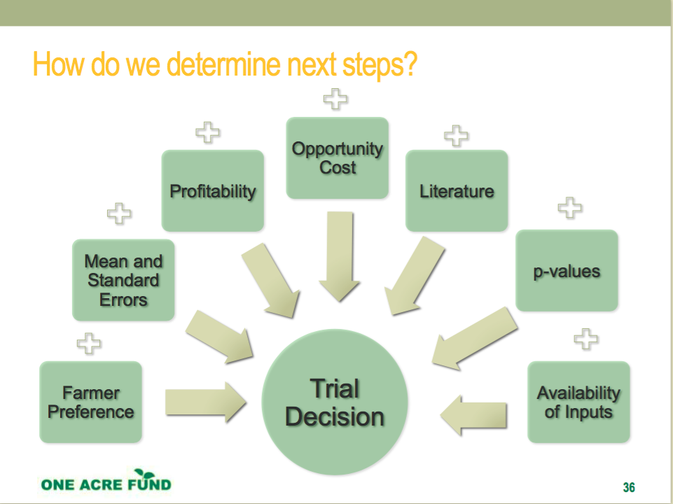

```{r setup, include=FALSE}

rm(list=ls())
cat("\014") 

# change code chunk default to not show warnings or messages
knitr::opts_chunk$set(warning = FALSE, message = FALSE)

## load libraries
libs <- c("tidyverse", "learnr", "farmr", "ggplot2", "knitr")
lapply(libs, require, character.only = T, quietly = T, warn.conflicts = F)

knitr::opts_chunk$set(echo = FALSE)

#  loading global dataset for the lesson

### 1AF datasets
sr17_data <- read_csv("www/KESR17_P1_ExampleDatClean.csv") ### Update this with a p2 RW dataset!
sr17_data <- sr17_data %>% filter(station == "KKMT")


rw18b_data <- read_csv("www/RW18b_p2data_clean.csv")
rw18b_data <- rw18b_data %>% mutate(Profit = profit) %>% dplyr::select(-profit)

### Demo datasets
group1_1 <- rnorm(1000, 50, 10)
group2_1 <- rnorm(1000, 20, 10)
group3_1 <- rnorm(1000, 15, 5)

anovaDemo1 <- data.frame(Yield = c(group1_1, group2_1, group3_1), 
                         Group = c(rep("Group1", 1000), 
                                   rep("Group2", 1000), 
                                   rep("Group3", 1000)))

group1_2 <- rnorm(1000, 25, 50)
group2_2 <- rnorm(1000, 25, 15)
group3_2 <- rnorm(1000, 25, 30)

anovaDemo2 <- data.frame(Yield = c(group1_2, group2_2, group3_2), 
                         Group = c(rep("Group1", 1000), 
                                   rep("Group2", 1000), 
                                   rep("Group3", 1000)))


```

## Agricultural Trial Analysis: Analysis and Interpretation

###  Objective 

At the end of this lesson you should be able to:

1. Understand the basic intuition behind multiple comparison analysis.
2. Efficiently execute code for agricultural trial analysis in R using the `farmr` package.
3. Understand how to interpret ANOVA and Tukey's HSD output.
4. Plot a course from analysis to interpretation to next steps.


### Motivation  

This lesson will be a dissection of ANOVA and Tukey’s HSD - two analytical tools we use for RCBD trial analysis - and how they function. The goal for this lesson is to create a more nuanced understanding of these tools that will lead to a stronger understanding of the results and how to formulate next steps and actionable recommendations. 

### Pre-Requisites

Before starting this lesson, you should be familiar with basic data manipulation techniques, summary statistics in R, and how to set up your data for analysis in R. You should also have completed the other AMP lessons on agricultural trial design, cleaning and describing data, and outliers.


### Discussion:

> What methods have you used for analysis / agricultural trial analysis in the past (either within or outside of One Acre Fund)? Why did you choose those methods?

####

Possible methods might be a simple comparison of means or running t-tests for each comparison of interest in the data. 

## Analysis of Variance

> Are you familiar with ANOVA tests? Can you explain a situation in which you would use ANOVA testing over t-tests?

####

If not, that's okay! The lesson ahead will explain how to use ANOVA regressions for understanding outcomes of agricultural trials.

### ANOVA: A Theory

### What is ANOVA?

Analysis of Variance (ANOVA) is a linear regression used to analyze the differences in means between groups based on known sources of variance (such as treatment) and unknown sources of variance (i.e. the error term). 

In its most basic form, ANOVA tells us whether there are significant differences between groups of our predictor variables. The test compares groups based on two sources of variation:

* The average variation of observations within each group
* The average variation of observations between groups

ANOVA then takes these averages and calculates the *F-statistic*, which is just the ratio of between group divided by within group variation.
 


### Discussion Questions

> 1. What do you think the sources of variation are in P1/P2 on-farm trials?
> 2. Why do we suggest using ANOVA over t-tests?


### 

Possible answers below: 

* Soil quality
* Proximity to the perimeter of the field
* Slope
* Your treatment (e.g. different seed/planting method)!

We will discuss the advantages of ANOVA over t-tests in the next section.`


### What are the advantages of using ANOVA over t-tests?

The probability of making a **Type 1** error is much higher when using multiple t-tests.

*Type 1 Error*: Type 1 errors are another way of saying false positives. False positives happen when we incorrectly identify a difference as significant when in fact there is not true difference. 

As the number of tests increases, the probability of finding a *significant* result also increases by chance.

For example, if we are making 10 comparisons the likelihood of making a type one error increases to c = 0.40 at the 5% significance level, or 1 - $(.9)^{10}$ = .65 at the 10% significance level.

### How does ANOVA correct for this?

Instead of using multiple t-tests, the ANOVA test will instead return a significant result if *any* group is significantly different from the other with a *single* test, producing the *F-statistic*. Because ANOVA only runs one test, that means that the probability of a Type 1 error is equivalent to the p-value: at 5% the significance level it is 1 - $(.95)^{1}$ = .05.


### ANOVA Intuition

```{r anova.visualization, exercise = TRUE}

ggplot(anovaDemo1, aes(x = Group, y = Yield, fill = Group)) + geom_boxplot() + theme_oaf() + geom_jitter(alpha = .2, aes(color = Group)) +  
  ggtitle("Sample Trial Data from 3 Treatments")

```

> Do you think the groups below show large or small variation within each group? What about between groups?

### Possible Answer

In this example, it appears there is a lot of variation between groups - 
group 1's distribution does not overlap much with either group 2 or group 3.


### Statistical Formulas in R

In R, the standard format for all formulas is: `dependent variable name ~ independent variables`. There is a separate argument for data in all ANOVA and regression functions. 

So, for example, if you wanted to calculate the regression of fertilizer on yields controlling for district you would use: `lm(yields ~ fertilizer + district, data = data)` (note: lm is an abbreviation for 'linear model', i.e. linear regression).

In ANOVA, the **independent variable must be a categorical variable.** 

> If we have a numerical variable, how might we change it to a categorical variable? Type in the R code below to change vector1 from a numerical to a categorical vector.

```{r numeric.cag, exercise = TRUE}

vector1 <- c(1,2,3,4)
class(vector1) # run this code to check if you changed the type


```

```{r numeric.cag-solution}

# Use the as.factor() wrapper around the variable you want R to recognize as categorical. 
factorVector1 <- as.factor(vector1)
class(factorVector1)

# For example, as.factor(data$fieldNum), or in a formula: 
# lm(Yield ~ as.factor(fieldNum), data = data)

```


### Exercise 1

> Try calculating the ANOVA F-statistic for the `Group` against `Yield` using the dataset anovaDemo1.

```{r anova.exercise1, exercise = TRUE, exercise.lines = 10}


```


```{r anova.exercise1-hint-1}

# Look up the 'aov' function.

```


```{r anova.exercise1-hint-2}

# Make sure to use the summary to get the F-statistic (as you would with a regression!).

# Note: the answer is in the next hint.
 
```


```{r anova.exercise1-solution} 

# answer
summary(aov(Yield ~ Group, data = anovaDemo1))

```

> What does the output show? How would you interpret this output? 


### Exercise 1 Solution

The output shows the f-statistic (F-value) for the 'Group' variable, as well as the corresponding p-value. Here, the P-value is less than .001, which indicates that there are significant differences between the groups.


### Exercise 2

```{r anova.visualization2, exercise = TRUE}

ggplot(anovaDemo2, aes(x = Group, y = Yield, fill = Group)) +  geom_boxplot() +
  geom_jitter(alpha = .2, aes(color = Group)) + theme_oaf() + 
  ggtitle("Sample Trial Data from 3 Treatments") 

```

> Do you think the groups below show large or small variation within each group? What about between groups?

### Possible Solution

In this example, it appears there is a lot of variation within groups -  the distributions of both group 1 and group 3 overlap substantially with both each other and group 2.

> Try calculating the ANOVA F-statistic for the group using the dataset anovaDemo2.

```{r anova.exercise2, exercise = TRUE, exercise.lines = 10}


```


```{r anova.exercise2-hint-1}

# Look up the 'aov' function

```


```{r anova.exercise2-hint-2}

# Make sure to use the summary

```

```{r anova.exercise2-solution}

# Make sure to use the summary

summary(aov(Yield ~ Group, data = anovaDemo2))

```


> What does the output show? Is there significant variation betwen groups?

### Possible Solution

As the p-value and F-statistic show, there is not significant variation between groups.


### ANOVA Assumptions

Before we move on, I would like to cover some basic assumptions of the ANOVA test:

* Observations are from a random sample and are selected independently of each other.
* Observations are distributed normally, or the sample size in each group is large (> 30).
* Observational groups have similar variance to one another.


It is *not* required to have equal sample size in the groups. We generally assume that agricultural trials cover these basic assumptions within 1AF, but if you apply ANOVA to another trial or analytical question please review your trial design and analytical plan with the <a href="https://docs.google.com/presentation/d/15zXT-o-RgAm-Nb7xTsTSrs3ldNHXk8HeXNd11tP0H6o/edit">Trial and Analysis Support Committee</a>.

### 1AF P1/P2 ANOVA Analysis

When One Acre Fund analyzes research station and on-farm trials we want to account for as many known sources of variation as possible. In the research station, for example, we intentionally block replications along known slopes to account for soil variability. In on-farm trials, we typically block replications of all treatments on each farm in order to account for differences between farms.

> How do you think we can account for this other known source of variation in our ANOVA formula call?

### Answer

We can account for it by adding another dependent variable in our formula.

> Calculate the ANOVA results for kgYieldPerAcre for the given dataset using on-farm trial results dataset `sr17_data`. Note that the variable for trial (e.g. seed variety) is `trial_number` and block is `block_number`.

```{r anova.p1.results, exercise = TRUE, exercise.lines = 5}


``` 

> What is your interpretation of the results?


### Results 

```{r anova.p1.results.solution, exercise = TRUE}

# solution

summary(aov(kgYieldPerAcre ~ as.factor(trial_number) + as.factor(block_number),
            data = sr17_data))

## remember to make sure your variables are factor variables!!

``` 

*`trial_number` is not significant*: we conclude there **are not** significant differences between the treatments in our station trial. However, since the p-value is still relatively low we can proceed to Tukey's HSD. We will talk more about what to do with insignificant results later on in this lesson.

*`block_number` is significant*: we conclude that there are meaningful differences between the blocks on the station. This means that the physical placement of the blocks did cause a significant difference in the outcome justifying our design decision to block the trials on the station.

> What do you think it would mean if block were not significant?

### If the blocks were not significant...

If the block variable is not significant, we could conclude that the gradient along which we blocked the trials did not meaningfully determine the outcome and thus we could have got the same result without blocking the trials, i.e. we could have run a completely randomized design instead of a randomized complete block design. 

The cost of unnecessarily blocking a trial is a loss of statistical power, meaning that it will take a larger sample to achieve the same results. 

## ANOVA with AEZ

> How do you think we can account for AEZ during ANOVA?

### Answer
 
It depends on how we plan to scale. If we can recommend and scale different varieties in different AEZs, then we should treat experiments in different AEZs as different experiments.

On the other hand, if we can only recommend the same variety to all farmers, then we should account for this additional variation in our ANOVA formula. For example, `aov(Yield ~ Treatment + Block + AEZ)`.
 
## ANOVA Next Steps

Now that we have identified that there is a significant difference *within* the groups, we need to check to see where this difference lies. Practically, we almost never examine ANOVA results by themselves and instead use an additional test to confidently determine where this difference lies. 

## Tukey's HSD

The role of mean separation tests is to take the ANOVA result and provide a more granular answer. The ANOVA equation above has answered the question, "are there any differences between the treatments?" A significant p-value for trial number tells use that there is at least one significant difference. The Tukey's Honest Significant Difference (HSD) means separation test will show us which treatment is different from which treatment.

> Any ideas what this test does and how it is differs from a normal t-test?

### Tukey's HSD Theory

The Tukey's HSD output shows us the p-value for each pairwise comparison in our group variable, adjusting for the number of comparisons. We would have to run 10 separate t-tests to get all of these results provided by Tukey's HSD. Whenever we execute numerous t-tests using the same data we run the risk of Type 1 error or a "false positive." The honest part of Tukey's HSD is that it adjusts the p-values to account for the number of comparisons we make allowing us to confidently interpret the result without worrying about false positive.

### Calculating Tukey's HSD

In order to calculate Tukey's HSD, we need to our save our ANOVA object. We can then use the `TukeyHSD` function in R to calculate the confident intervals by `trial`. **All variables need to be in factor-form. If you do not know how to do this, see the hint.**

Use the `sr2017_dat` set to calculate Tukey's HSD for each trial (*only* trial, not block). Set the confidence level to 90%. If you do not know how to do these, check the documentation!

```{r tukey.hsd, exercise = TRUE, exercise.lines = 5}

# write the code to generate the Tukey's HSD output here.

```


```{r tukey.hsd-hint}

# To coerce numerical variables to factors, you can use 'as.factor()`.

```

> What do you notice about the above output?


### Tukey's HSD Solution

```{r tukey.hsd.solution, exercise = TRUE}

# solution

anovatest <- aov(kgYieldPerAcre ~ as.factor(trial_number) + as.factor(block_number),data = sr17_data)
TukeyHSD(anovatest, which = c("as.factor(trial_number)"))

```

The Tukey's HSD output in shows us the p-value for each pairwise comparison in our trial number variable *adjusting for the number of comparisons*. In this specific example, no values were significant.

## `farmr` Package

Now that you have developed some of the intuition on why we use a combination of ANOVA and Tukey's HSD to analyze our RCBD trials, we will go over a function specifically created in One Acre Fund's `farmr` package to output the clean analysis for you.

### `analyze_ag_trials` 

The analyze_ag_trials function takes 5 arguments:

1. `dataset` The full dataset you want to analyze.
2. `depVariable` - the name of the dependent variable of your formula. Most often, this will be your yield per hectare/acre/are variable.
3. `experimentVariable` - The name of the variable that designates the experiment, e.g. if it is a maize variety trial or a fertilizer trial.
4. `treatmentVariable` - The name of the variable that designates which treatment the data is coming from, e.g. the specific maize variety or fertilizer.
5. `blockVariable` - The name of the variable that specifies which block the data came from.
6. `...` - Finally, you can add in the name of any other variables you would like to compute means and confidence intervals for. Most often this is profit, but some teams also include germination rates. You just need to list each variable you want to add followed by a comma. This is optional.

An example with profit: <br>

* rcbdOutput <- analyze_ag_trials(finalData, kgAcre, block_type_number,  
seedName, blockNumber, profit)

<br><br>
An example without profit: <br>
* rcbdOutput <- analyze_ag_trials(finalData, kgAcre, block_type_number,  
seedName, blockNumber, profit)

### `analyze_ag_trials` Exercise 1

> Use the `analyze_ag_trials` function to calculate the results for the `sr17_data` using kgYieldPerAcre as the dependent variable. Note that `block_type_number` refers to the experiment here.

```{r analyze.ag.trials1, exercise = TRUE, exercise.lines = 5}


```

> What is your interpretation of the output? What do the Trial1Outcome and Trial2Outcomes show?

### `analyze_ag_trials` Exercise 1 Solution

```{r analyze.ag.trials1solution, exercise = TRUE}

# solution
output <- analyze_ag_trials(sr17_data, kgYieldPerAcre, block_type_number,
                            name, block_number)

```

If we look at our output, it appears that no seed varieties were statistically significant for experiment 10. 

The Trial1 and Trial2 Outcome columns show the mean and confidence intervals for the mean for each variety.

In the final section, we will discuss what to do when results are insignificant and/or conflicting.

### `analyze_ag_trials` Exercise 2

> Use the `analyze_ag_trials` function to calculate the results for the Phase 2 `rw18b_data`, including the additional statistcs on profit, cobSize, topChoice, and germinationRate.

The dataset has the following variables:

* Block - Block number for the trial
* ExperimentName - The name of the experiment (not AEZ specific)
* ExperimentNumber - The number of the experiment, specific to each aEZ
* Treatment - Treatment variable
* yieldAre - Yield per Are
* topChoice - Yes/no (boolean) value for whether or not the seed was the farmer's top choice
* germinationRate - Germination rate for the seed
* profit - Profit per are
* cobSize - Average size of the cobs


```{r analyze.ag.trials2, exercise = TRUE, exercise.lines = 5}


```

> What is your interpretation of the output? What do the Trial1Outcome and Trial2Outcomes show?

### `analyze_ag_trials` Exercise 1 Solution

```{r analyze.ag.trials2solution, exercise = TRUE}

# solution
rwandaOutput <- analyze_ag_trials(rw18b_data, yieldAre, ExperimentNumber,
                            Treatment, Block, Profit, germinationRate, cobSize,
                            topChoice)

rwandaOutput

```


As we can see from the Rwanda output, a few seeds stood out - for example, PAN4M21 in experiment 6. Not only did it have higher yields than other varieties, but almost all farmers preferred it.

The Trial1 and Trial2 Outcome columns show the mean and confidence intervals for the mean for each variety.

In the final section, we will discuss what to do when results are insignificant and/or conflicting.


## Interpreting Results

### Note on P-Values

P-values are a useful but thorny test statistic. On one hand, they give us a quick indication of whether a result is statistically meaningful. On the other, p-values can simplify and obscure the more important questions we should ask whenever we design and analyze a trial. Here are key ideas to keep in mind when reading p-values:

* P-values were never intended to be a stand alone indicator of significance. P-values were created by Ronald Fisher (of F-test fame) to be an informal indicator of whether a finding was worth a second look. Thus, from conception, p-values were intended to be used as part of a system.

* P-values are calculated relative to a specific null hypothesis (typically this is, "the means of the groups are equal") but we must remember the underlying likelihood of seeing an effect in the first place. We should be skeptical when we see a strong p-value on a variable for which we have no prior expectation of a significant difference (ie. have no prior justification for rejecting the null hypothesis) 

* Finally, the emphasis should be on economically meaningful effects, not only effects with statistically significant p-values. Practically, I recommend reporting confidence intervals with our findings. We can also calculate effect sizes to further contextualize the magnitude of change due to the treatment.


## Using Results for Decision-Making

The sequence of ANOVA, Tukey's HSD, p-values, confidence intervals and effect sizes provide statistical indications of how meaningful a finding may be but they are only part of the decision process for advancing or scaling a trial. The figure below shows the various elements worth considering when making an interpretation and scaling decision:

```{r, out.width='100%'}



```

Most of the decision dimensions mentioned in the figure above will be intuitive however I hope the figure is a useful reminder of all the elements we should weigh when making a trial decision. I want to call attention to two elements in particular: the literature and farmer preference. 

"The Literature" can be demystified to say "our expectation before we saw the results." We often run so many station and on-farm trials that we do not have clearly articulated magnitude differences we expect to see from the trial. The more we can tie an expected effect size to an observed effect size and p-value, the more grounded we will be in our interpretations. 

Second, we all understand the importance of farmer preference. If farmers aren't willing to adopt a new product or practice, the marginal impact of that product is irrelevant. I recommend, in addition to quantifying farmer preference during trials, to use farmer preference as the **justification** for new trials. We clearly have a role to play in providing good options to farmers but involving farmers earlier in the process, before trial resources are spent, may help unlock farmer preference for promising new practices.


## Examples

### Full Stops

* P-value indicates no difference in yields and it’s more expensive
* Not profitable for farmers
* Inputs not available and no prospects of availability
* Low likelihood of adoption
* More complex versus alternative with no yield or profit benefit
* P-value indicates a significantly lower yield

### Pause

* P-value indicates no yield difference
* Opportunity cost of prioritizing this trial is too high
* Inputs not available and no prospects of availability
* Low likelihood of adoption
* Unclear result and no clear channel for impact or adoption
* Low scalability but still worth considering for later season

### Repeat Trial?

* P-value indicates no yield difference despite literature suggesting otherwise
* Trial conditions not right (e.g. no disease pressure)
* Poor hypotheses and measurement
* Confounding factors like Striga or drought
* Want to retrial but in a different context

## Homework

* Calculate the results for your own on-farm data and recommendations.


## Appendix: Deeper ANOVA Theory

Analysis of Variance (ANOVA) is actually linear regression used to analyze the differences in means between groups based on known sources of variance and unknown sources of variance (error term). 

Here's an easy short hand for the interpretation of ANOVA output values:

* Total Sum of Squares (TSS): This is the sum of total deviations from the mean for this variable. The larger the sum of the deviations, the more variance in this variable.

* Mean Sum of Squares (MSS): This is the average deviation for this variable. What we want to see is that the MSS of the residual is lower than the MSS for our explanatory variables. This means that our variables are capturing most of the variance in the outcome. If the MSS of the residuals were large, that would mean we may not be explaining the outcome variable well with our variables. It's important to remember that at this stage, we are still working with **all** levels of trial number. We are not able to make conclusions about differences between one level of the outcome variable and  another level of that variable.

* F-value and p-value: The F-value is the MSS of the variable divided by the MSS of the residuals. The smaller the MSS of the residuals, the larger the resulting F-value. 

Let's look at how we would replicate the ANOVA result using an OLS regression to build our intuition for how ANOVA and OLS answer complimentary questions. We use an OLS model including trial number and block as factor predictor variables. Factors in an OLS regression will be read as n-1 dummy variables with the lowest value, in this case where trial number == 1 (the control)  will be excluded. The same goes for the block variable. You will notice that trial number1 and block1 are both missing from the regression results.

```{r ols.anova, echo = TRUE}

reg <- lm(kgYieldPerAcre ~ as.factor(trial_number) + as.factor(block_number), data = sr17_data)

summary(reg)

```


The coefficients for each variable represent how different they are from the control. How does this compare to the Tukey's HSD result?

```{r tukey.ols, echo = TRUE}

anovatest <- aov(kgYieldPerAcre ~ as.factor(trial_number) + as.factor(block_number), data = sr17_data)

TukeyHSD(anovatest, which = c("as.factor(trial_number)"))

```


We can see that the coefficients are the same as the difference between each treatment and the control! 

An OLS regression excludes one group and all coefficients are in reference to that group. What about comparisons to other treatments? There are two ways we can test how the other treatments compare to one another.

* Option 1 is to change the reference group in the regression. The R and STATA default to setting the lowest category as the reference group. However, we could tell R to set trial number == 2 as the reference group and so on to see how all the treatments compare. This would take some time though.

* Option 2 is to use an F-test to assess the equivalency of the coefficients. This is the OLS version of completing full pairwise comparisons using the `linearHypothesis` function from the `car` package.


